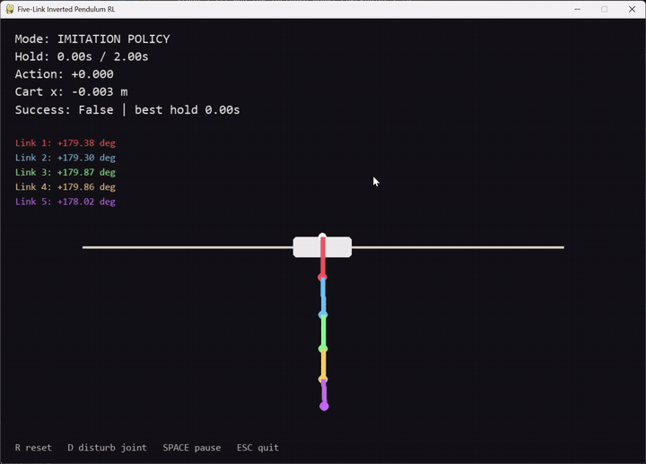

# Five-Link Inverted Pendulum

I built a physics simulation of a cart with five connected pendulums and trained a controller to swing them up and keep them balanced. The final approach uses imitation learning from optimized expert trajectories, with behavioral cloning and DAgger.



The included controller succeeded in **512/512 evaluation runs**. Success means all five poles stay within 10° of upright and below 0.5 rad/s for 2 seconds without the cart leaving the track.

## Run it

Requires Python 3.11+ and the included model checkpoint (`runs/imitation_complete/best.pt`).

```bash
pip install -r requirements.txt
python play.py
```

**Controls:** `R` reset · `D` disturb a joint · `Space` pause · `Esc` quit.

To evaluate the model:

```bash
python evaluate.py --episodes 512 --seed 91000
```

To train a new model (requires `experts/library.pt`):

```bash
python train.py --expert experts/library.pt --output runs/imitation_new
```

\* ChatGPT was used to generate the test and expert code.